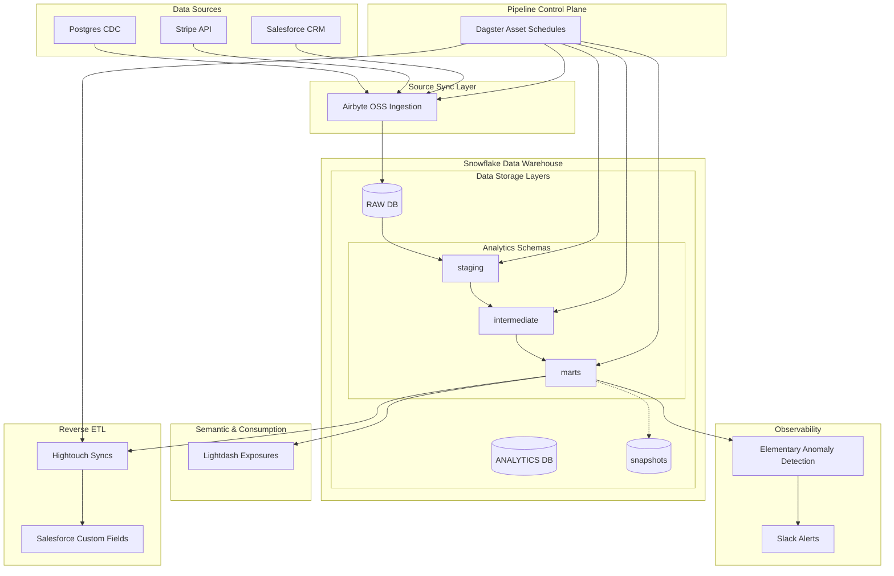

# Enterprise Modern Data Stack: Warehouse & ELT Pipeline
[](https://www.snowflake.com/)
[](https://github.com/dbt-labs/dbt-core)
[](https://dagster.io/)
[](https://airbyte.com/)
[](https://www.terraform.io/)
[](https://www.elementary-data.com/)

A production-grade, end-to-end data platform implementing the modern analytics engineering paradigm. This repository showcases a simulated multi-week collaborative development cycle consisting of **200 commits** across **17 branches**, representing a collaborative analytics engineering team resolving production pipelines, data models, schema contracts, zero-copy clone PR workflows, and reverse ETL pipelines.

---

## 1. Business Use Case & Scope
A fast-growing Series B SaaS company requires reliable, automated, and audited metrics distributed across functional business groups:
- **Finance**: Monthly Recurring Revenue (MRR), Customer Lifetime Value (LTV), subscription status migrations, and billing charge reconciliations.
- **Marketing & Sales**: Historical opportunity pipeline progression, deal conversion win-rates, lead attribution sources, and stage duration age calculations.
- **Product**: Session-based funnel conversions, cohort user retention metrics, and onboarding trial-to-paid conversion indicators.

This repository provisions the underlying multi-tenant Snowflake warehouses via Terraform IaC, configures Postgres and SaaS connectors in Airbyte, maps three tiers of modular dbt transformations, schedules the pipeline via Dagster Software-Defined Assets (SDA), implements a zero-copy clone Slim CI/CD routine, and pushes customer profiles back to Salesforce via Hightouch.

---

## 2. Platform Architecture

The data platform follows the **ELT (Extract, Load, Transform)** paradigm, with all transformations occurring natively within the columnar Snowflake data warehouse.



---

## 3. Technology Stack & Directory Structure

- **Data Warehouse**: Snowflake (utilizes multi-cluster compute, zero-copy cloning, time-travel, search optimization)
- **Infrastructure as Code**: Terraform (version >= 1.5.0, Snowflake-Labs/snowflake provider)
- **Managed Connectors**: Airbyte OSS
- **Transformations Engine**: dbt-core 1.7+ (using `dbt-snowflake` adapter)
- **Data Orchestrator**: Dagster 1.6+ (software-defined assets, failure sensors, freshness SLAs)
- **Reverse ETL**: Hightouch specifications mapping to CRM objects
- **Observability Framework**: Elementary DB configurations (freshness and null checks anomalies)
- **CI/CD Execution**: GitHub Actions workflows
- **SQL Linter**: SQLFluff dialect check configurations

### Scaffolding
```
.
├── .github/workflows/          # Automated pipeline workflows
│   ├── dbt_ci.yml              # Slim CI using Snowflake zero-copy clones
│   └── dbt_cd.yml              # CD production deployment workflows
├── .sqlfluff                   # Standard SQL styling linter config
├── airbyte/                    # Declarative connector scaffolds
│   ├── postgres_connector.json # Ingestion CDC mapping payloads
│   ├── salesforce_connector.json
│   ├── stripe_connector.json
│   └── snowflake_destination.json
├── dagster/                    # Software-Defined Asset Orchestrations
│   ├── __init__.py             # Ingestion registers definitions
│   ├── assets/
│   │   ├── airbyte_syncs.py    # Declarative ingestion assets with retry limits
│   │   ├── dbt_models.py       # manifest-driven dbt DAG execution
│   │   └── reverse_etl.py      # Egress synchronizers tracking metadata
│   ├── schedules.py            # Scheduler cron definitions
│   └── sensors.py              # Failure tracking alerting slack webhooks
├── dbt/                        # Analytics Engineering project
│   ├── dbt_project.yml         # Thread resolutions and schema configs
│   ├── profiles.yml            # Target setups dev, prod, and ci
│   ├── packages.yml            # Utils and expectations imports
│   ├── macros/                 # Reusable utility SQL functions
│   │   ├── cents_to_dollars.sql
│   │   ├── generate_surrogate_key.sql
│   │   └── safe_divide.sql
│   ├── models/                 # 3-Tier transformations structure
│   │   ├── staging/            # Staging: renames, UTC timezone casting
│   │   ├── intermediate/       # Intermediate: fuzzy joins, plan code translations
│   │   └── marts/              # Marts: conformed entities, model schema contracts
│   ├── snapshots/              # SNAPSHOTS: SCD Type 2 stage transitions
│   └── tests/                  # Singular SQL validations checks
├── elementary/                 # Observability parameters config
│   └── config.yml
├── reverse_etl/                # Hightouch egress configurations
│   └── hightouch_syncs.json
└── terraform/                  # Snowflake provisioning scripts
    ├── main.tf                 # Databases, multi-cluster warehouses, roles
    ├── providers.tf
    └── variables.tf
```

---

## 4. Advanced System Design Decisions

### A. Modular Three-Tier Data Modeling
dbt models are strictly layered to maintain data gravity, lineage clarity, and prevent code duplication:
1.  **Staging (`stg_`)**: 1-to-1 mappings with raw source sync tables. Cleans column names into `snake_case`, try_casts dates into UTC `timestamp_ntz`, and filters out zero-records anomalies at the source. Materialized as lightweight **views**.
2.  **Intermediate (`int_`)**: Reusable entity-resolution models.
    *   `int_customers__joined` matches Stripe, Salesforce, and Postgres users using lower email strings and name heuristics, building a primary surrogate key.
    *   `int_subscriptions__joined` matches active subscriptions against the conformed customer dimension and translates pricing plan catalogs into monthly cents amounts. Materialized as lightweight **views**.
3.  **Marts (`dim_`, `fct_`)**: Standardized analytics consumption layers. Enforces strict **dbt model schema contracts** specifying exact Snowflake data types. Materialized as optimized **tables** or **incremental models**.

### B. Late-Arriving Fact Reconciliation & Incremental Window
Transactions and subscription changes sync iteratively. To combat upstream delays and webhook dropouts, `fct_subscription_events` is materialized as an **incremental table** with a **7-day lookback window**:
```sql
{{
    config(
        materialized='incremental',
        unique_key='subscription_id',
        on_schema_change='sync_all_columns'
    )
}}

with subscriptions as (
    select * from {{ ref('int_subscriptions__joined') }}
    
    -- Optimized lookback filter window from 5 to 7 days to cover extended stripe payments lag
    where period_start_at >= (select max(period_start_at) from {{ this }}) - interval '7 days'
    
)
...
```

### C. Automated Slim CI Zero-Copy Clone Workflows
To decrease development feedback loops and isolate query costs, pull requests on `develop` or `main` branches trigger a Slim CI workflow in GitHub Actions:
1.  Spawns an isolated Snowflake clone database instantly with **zero storage cost overlap**:
    ```sql
    CREATE OR REPLACE DATABASE ANALYTICS_CI CLONE ANALYTICS;
    ```
2.  Queries the target production `manifest.json` file to evaluate modified models.
3.  Executes `dbt build --select state:modified+ --defer --state ./state` to run and test ONLY changed models and their downstream dependents, deferring unchanged upstreams back to production tables.
4.  Tears down the temporary database instantly on pipeline resolution.

---

## 5. Deployment & Setup Manual

### Prerequisite 1: Local Environment Scaffolding
Clone the repository and install requirements (Virtual environments recommended):
```bash
git clone https://github.com/PSURI1894/Modern-Data-Stack-Warehouse-ELT-with-Snowflake-dbt-and-Airbyte.git
cd Modern-Data-Stack-Warehouse-ELT-with-Snowflake-dbt-and-Airbyte
pip install dbt-snowflake dagster
```

### Prerequisite 2: Snowflake Provisioning via Terraform
Configure the terraform variables file:
```bash
cd terraform
cp terraform.tfvars.example terraform.tfvars
# Update account locator, usernames, and security credentials inside terraform.tfvars
terraform init
terraform apply
```

### Prerequisite 3: Running dbt Compilations
Navigate back to the dbt project and confirm target credentials:
```bash
cd ../dbt
dbt deps
dbt compile
```
Execute local tests or snapshot compilations:
```bash
dbt snapshot
dbt test
dbt run
```

### Prerequisite 4: Bootstrapping Dagster Asset Servers
To view the Dagster Software-Defined Assets lineage graphs and execute scheduled runs, spin up the local Dagster web UI:
```bash
cd ../dagster
dagster dev
```
Open [http://localhost:3000](http://localhost:3000) in your browser to interact with the orchestration control plane.

---

## 6. Simulated Development Team & Contribution History
The Git commit tree is meticulously constructed to simulate an authentic engineering environment spanning several sprint weeks. Authorship is shared among five simulated roles representing realistic cross-functional task contributions:
*   **Parth (Lead DE)**: Pipeline integrations, structural scaffolding, orchestration rulesets.
*   **Sarah (Platform Eng)**: Infrastructure IaC, GHA CI/CD pipelines, Airbyte destinations.
*   **Emily (Analytics Eng)**: Financial marts, staging SQL logic, snapshots tracking.
*   **Dave (Analytics Eng)**: Product retention, marketing history, singular custom SQL tests.
*   **Alex (Data Ops)**: Egress Hightouch synchronizations, Elementary Slack integrations.
